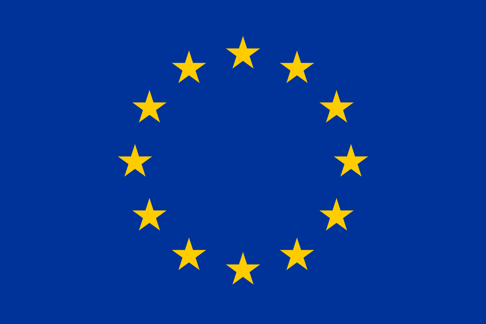

# 🧠 European Gen AI Hub

<div align="center">



**European Generative AI Research Space**

*A comprehensive hub for exploring and accessing the latest knowledge on Generative AI research and innovation across the European Union*

[](https://replit.com/@your-username/europe-genai)
[](LICENSE)

</div>

## 🌟 Overview

European GenAI Hub is a modern, interactive web space that serves as a one-stop destination for researchers, engineers, and AI enthusiasts to discover European Generative AI research initiatives, institutions, projects, and resources.


### ✨ Key Features

- 🚀 **Active Projects** - Discover ongoing GenAI initiatives across Europe & Swiss
- 🧠 **LLM/VLM Models** - Browse European language and vision models
- 🏛️ **Research Institutions** - Explore leading European AI research centers and universities
- 📚 **Resources** - Access to datasets, tools, papers, and benchmarks
- 🔍 **Search** - Filter and search across all content types
- 📱 **Responsive Design** - Optimized for desktop and mobile devices
- ⚡  **Fast Performance**: Optimized loading and search performance
- 🔒 **Secure**: XSS protection and security best practices


## 🚀 Quick Start

1. **Clone or Fork** this repository
2. **Run locally** using any static file server:
   ```bash
   python -m http.server 5000
   ```
3. **Open** `http://localhost:5000` in your browser


## 🛠️ Technology Stack

- **Frontend**: Vanilla JavaScript (ES6+), HTML5, CSS3
- **Styling**: Custom CSS with modern design principles
- **Icons**: Lucide Icons
- **Maps**: Leaflet.js with OpenStreetMap
- **Charts**: Chart.js for data visualization
- **Data**: JSON-based content management


## 🎯 Core Sections

### 🏛️ Institutions
Browse leading European AI research institutions including:
- Universities and research centers
- Industry labs and startups
- Government research facilities

### 🚀 Featured European AI Initiatives 
Explore active projects such as:
- AI On Demand Platform
- ADRA Association
- European AI Office
- ETH & EPFL AI
- OpenEuroLLM Project

### 🧠 Models
Discover European-developed models:
- Multilingual language models
- Vision-language models
- Domain-specific AI models

### 📚 Resources
Access research resources including:
- Open datasets and benchmarks
- Research papers and reports
- Tools and frameworks


## 👨‍💻 Managed By

**Dr. Kunal Suri** - Platform Manager & Curator

[](https://www.linkedin.com/in/kunalsuri/)


## 🤝 Contributing

We welcome contributions to expand and improve the European GenAI Hub:

1. **Improvements**: Enhance functionality or design
2. **Add Institution**: Submit new research institutions
3. **Update Projects**: Share ongoing GenAI initiatives
4. **Resources**: Contribute datasets, tools, or important papers


## 📄 License

This project is licensed under the MIT License - see the [LICENSE](LICENSE) file for details.


## 🙏 Acknowledgments

- European Commission for several ongoing AI research initiatives
- Contributing research institutions and projects
- Open source community for tools and libraries

---

<div align="center">

**Supporting European GenAI R&D Excellence** 🇪🇺

*Powered by GitHub + Hugging Face*

*Maintained by [GitHub/@kunalsuri](https://github.com/kunalsuri) with ❤️ from Paris* 

</div>
